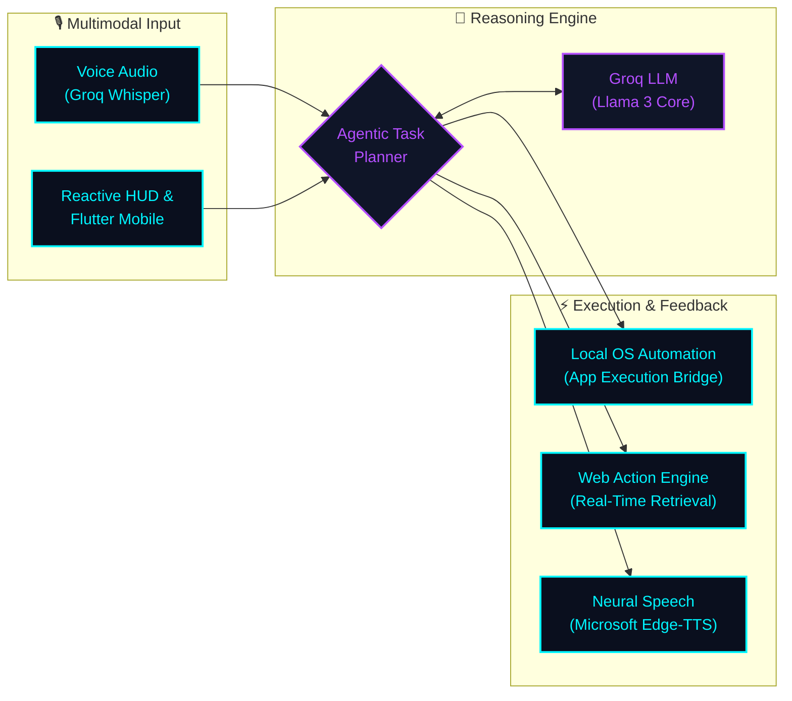

<div align="left">

# Hi, I'm Atharv 👋

### Building practical software, AI assistants & intelligent applications.

<p align="left">
  <a href="https://git.io/typing-svg">
    
  </a>
</p>

```yaml
┌── [ AT-1006 // DEVELOPER TELEMETRY ] ──────────────────────────────────────────────┐
│                                                                                    │
│  ● STATUS      : ACTIVE BUILDER & ENGINEERING STUDENT                              │
│  ● LOCATION    : MUMBAI, INDIA [UTC+05:30]                                         │
│  ● FOCUS       : AUTONOMOUS AGENT LOOPS · MULTIMODAL ASSISTANTS · REACTIVE HUDS    │
│  ● ECOSYSTEM   : OMNIAI [AGENT CORE] · CELESTERA [MOBILE AI] · JARVIS [HUD]        │
│  ● MISSION     : BRIDGING AUTONOMOUS REASONING WITH PRACTICAL EVERYDAY WORKFLOWS   │
│                                                                                    │
└────────────────────────────────────────────────────────────────────────────────────┘
```

</div>

---

### 👨‍💻 About Me

I am a software developer focused on engineering practical, real-world applications and integrating machine intelligence into everyday workflows. I build across mobile, desktop, and web environments, combining clean software engineering principles with modern AI/LLM capabilities.

- 🎯 **Focus**: Developing useful AI-powered software, intuitive mobile applications, and automated workflows.
- 💡 **Philosophy**: Prioritizing working software, responsive interfaces, and practical problem-solving over hype.
- 🎓 **Background**: Engineering student with strong fundamentals in algorithms, systems, and application architecture.

---

### 🧬 System Architecture: The Agentic Pipeline

*An overview of how my autonomous systems (such as OMNIAI and Celestera) process input, reason through tasks, and execute actions:*



<details>
<summary><b>🔍 [EXPAND] Deep Dive: Inside the OMNIAI Agent Execution Loop</b></summary>
<br />

1. **Perception**: Audio buffers captured via Web Audio API or mobile mic are streamed to Groq Whisper for sub-second text transcription.
2. **Intent Parsing**: The prompt is processed against dynamic tool signatures to determine if the query is conversational or requires system execution.
3. **Safety-Guarded Execution**: Whitelisted application bridges invoke local Windows targets (`VS Code`, `Notepad`, `Calc`) without injecting unsanitized shell commands.
4. **Multimodal Feedback**: Output payloads stream structured JSON to the React HUD while synthesizing neural audio with custom Edge-TTS prosody.
</details>

---

### 🔭 Currently Exploring

- 🤖 **Agentic AI**: Multi-step reasoning loops, autonomous planning, and structured tool calling.
- ⚡ **AI-Powered Applications**: Practical LLM integrations with real-time web search and neural voice pipelines.
- 💻 **Local Computer Automation**: System-level bridges to interact with and control desktop applications safely.
- 📱 **Modern Software Development**: Scalable Flutter architectures, reactive frontends, and cloud data synchronization.

---

### 🛠️ Tech Stack

#### Languages & Core
<p align="left">
  
  
  
  
  
</p>

#### Application & Mobile Development
<p align="left">
  
  
  
  
</p>

#### AI & Intelligent Systems
<p align="left">
  
  
  
  
</p>

#### Tools & Data Analytics
<p align="left">
  
  
  
  
  
</p>

---

### 🚀 Featured Projects

<table>
  <tr>
    <td width="50%" valign="top">
      <h3>🤖 OMNIAI</h3>
      <p>An autonomous AI assistant inspired by futuristic interfaces, featuring low-latency voice interaction, intelligent tool calling, and native local PC automation.</p>
      <p><b>Tech:</b> <code>Python</code> · <code>FastAPI</code> · <code>Groq LLM</code> · <code>Edge-TTS</code> · <code>React</code></p>
      <p>🔗 <a href="https://github.com/AT-1006/OMNIAI">View Repository</a></p>
    </td>
    <td width="50%" valign="top">
      <h3>✨ Celestera</h3>
      <p>A multipurpose AI assistant mobile application equipped with dynamic assistant personas, on-device biometric authentication, and cloud-synced conversation history.</p>
      <p><b>Tech:</b> <code>Flutter</code> · <code>Dart</code> · <code>Firebase</code> · <code>Groq API</code> · <code>Biometrics</code></p>
      <p>🔗 <a href="https://github.com/AT-1006/Celestera-AI">View on GitHub (Live Repo)</a></p>
    </td>
  </tr>
  <tr>
    <td width="50%" valign="top">
      <h3>📱 Attendance Management System</h3>
      <p>A cross-platform mobile application developed to automate and streamline student and employee attendance logging with real-time cloud data storage.</p>
      <p><b>Tech:</b> <code>Flutter</code> · <code>Dart</code> · <code>Firebase Auth</code> · <code>Cloud Firestore</code></p>
      <p>🔗 <a href="https://github.com/AT-1006/attendance-management-system">View Repository</a></p>
    </td>
    <td width="50%" valign="top">
      <h3>📊 Spotify Data Analytics Dashboard</h3>
      <p>An interactive business intelligence project analyzing music streaming trends, audio feature distributions, and artist popularity metrics using Power BI.</p>
      <p><b>Tech:</b> <code>Power BI</code> · <code>Data Analysis</code> · <code>DAX</code> · <code>Excel</code></p>
      <p>🔗 <a href="https://github.com/AT-1006/Spotify-Analysis-PowerBI">View on GitHub (Live Repo)</a></p>
    </td>
  </tr>
  <tr>
    <td width="50%" valign="top">
      <h3>⌚ Casio Mobile Store</h3>
      <p>A native Android e-commerce and catalog application showcasing G-Shock, Vintage timepieces, scientific calculators, and musical instruments with custom floating navigation.</p>
      <p><b>Tech:</b> <code>Android</code> · <code>Java</code> · <code>Material Design</code> · <code>RecyclerView</code></p>
      <p>🔗 <a href="https://github.com/AT-1006/Casio-mobile-app">View on GitHub (Live Repo)</a></p>
    </td>
    <td width="50%" valign="top">
      <h3>🌐 Jarvis HUD — Reactive Sci-Fi Interface</h3>
      <p>A cyberpunk-themed reactive HUD interface with an audio-reactive voice orb powered by the Web Audio API, draggable telemetry panels, and real-time system monitoring.</p>
      <p><b>Tech:</b> <code>React 19</code> · <code>TypeScript</code> · <code>Vite</code> · <code>Web Audio API</code> · <code>Tailwind CSS</code></p>
      <p>🔗 <a href="https://github.com/AT-1006/jarvis-frontend">View on GitHub (Live Repo)</a></p>
    </td>
  </tr>
</table>

---

### 📊 GitHub Activity & Telemetry

<div align="center">


</div>

<br />

<div align="center">
  
</div>

<br />

<div align="center">
  
</div>

---

### 📬 Connect With Me

<p align="left">
  <a href="https://linkedin.com/in/atharv-gawand">
    
  </a>
  <a href="https://instagram.com/your-username">
    
  </a>
  <a href="mailto:atharvgawand2@gmail.com">
    
  </a>
</p>

---

<div align="center">
  <sub>Always building. Always learning. 🚀</sub>
</div>
